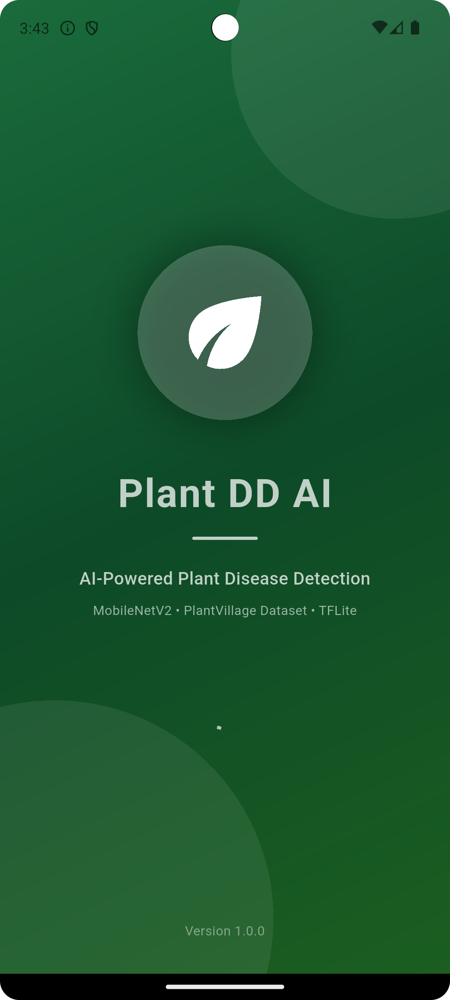
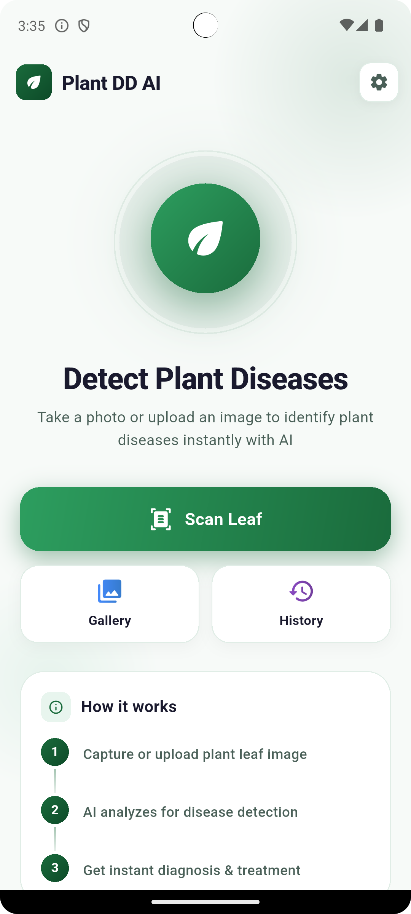
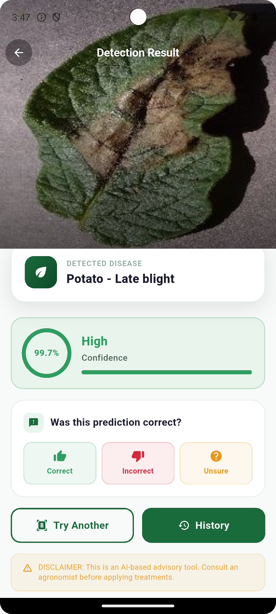
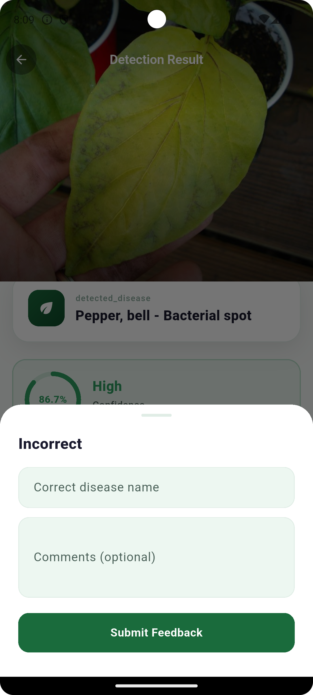
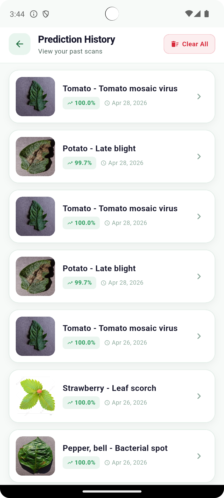
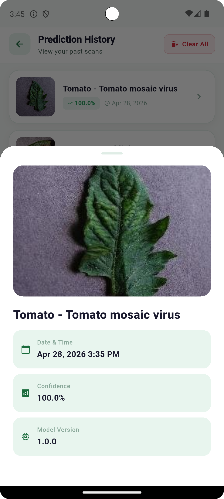
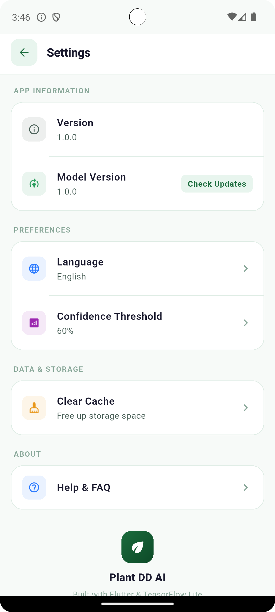

<div align="center">



# 🌿 Plant DD AI

### Smartphone-Based Plant Disease Detection Using Transfer-Learned MobileNetV2

[](https://flutter.dev)
[](https://dart.dev)
[](https://pub.dev/packages/tflite_flutter)
[](LICENSE)
[](https://flutter.dev)

**Detect crop diseases instantly from leaf photos — fully offline, no internet required.**

[Features](#-features) • [Screenshots](#-screenshots) • [Architecture](#-architecture) • [Getting Started](#-getting-started) • [Testing](#-testing) • [Disclaimer](#-disclaimer)

</div>

---

## 📖 Overview

**Plant DD AI** is a Flutter mobile application that enables farmers and agronomists to detect plant diseases directly from leaf photographs using a fine-tuned **MobileNetV2** convolutional neural network deployed via **TensorFlow Lite**. All inference runs entirely on-device — no internet connection required for core functionality.

The app supports **38 disease classes** across 14 crop species (tomato, potato, apple, bell pepper, strawberry, and more), providing real-time disease diagnosis with confidence scores and treatment suggestions.

---

## ✨ Features

| Feature | Description |
|---|---|
| 🔍 **Real-time Detection** | Classify leaf diseases in 200–500ms on mid-tier devices |
| 📷 **Camera & Gallery** | Capture live or upload from gallery (JPG/PNG, ≤10MB) |
| 📊 **Confidence Scoring** | Color-coded confidence: 🟢 High (>85%) 🟡 Medium (60–85%) 🔴 Low (<60%) |
| 💊 **Treatment Suggestions** | Cultural, chemical, and biological control recommendations |
| 🗃️ **Prediction History** | Full CRUD history stored locally in SQLite |
| 💬 **User Feedback** | Mark predictions Correct / Incorrect / Unsure |
| 🌐 **Bilingual** | English and Bengali language support |
| ☁️ **Cloud Sync** | Optional Firebase sync for model updates and feedback |
| ✈️ **Fully Offline** | 100% offline inference — works anywhere |

---

## 📸 Screenshots

<div align="center">

<table>
  <tr>
    <td align="center">
      <br/>
      <sub><b>Splash Screen</b></sub>
    </td>
    <td align="center">
      <br/>
      <sub><b>Home Screen</b></sub>
    </td>
    <td align="center">
      <br/>
      <sub><b>Detection Result</b></sub>
    </td>
  </tr>
  <tr>
    <td align="center">
      <br/>
      <sub><b>Feedback Form</b></sub>
    </td>
    <td align="center">
      <br/>
      <sub><b>Prediction History</b></sub>
    </td>
    <td align="center">
      <br/>
      <sub><b>History Detail</b></sub>
    </td>
  </tr>
  <tr>
    <td align="center" colspan="3">
      <br/>
      <sub><b>Settings</b></sub>
    </td>
  </tr>
</table>

</div>

---

## 🏗️ Architecture

The app follows a clean **layered architecture** with strict separation of concerns:

```
Presentation Layer  →  Controllers Layer  →  Services Layer
                                         →  ML/Inference Layer
                                         →  Data Layer (SQLite)
```

### Design Patterns Used

| Pattern | Implementation |
|---|---|
| **Repository** | `DatabaseManager` delegates to `PredictionsDao`, `FeedbackDao`, `DiseaseInfoDao` |
| **Observer** | `PredictionProvider` / `HistoryProvider` extend `ChangeNotifier` via Provider |
| **Strategy** | `ImagePreprocessor` accepts any `PreprocessingStrategy` (default: `MobileNetV2Preprocessor`) |

### Tech Stack

| Category | Technology | Version |
|---|---|---|
| Framework | Flutter | 3.x |
| Language | Dart | >=3.10.3 |
| ML Inference | TensorFlow Lite (`tflite_flutter`) | 0.11.0 |
| Image Processing | OpenCV (`opencv_dart`) | 1.4.3 |
| Local Database | SQLite (`sqflite`) | 2.4.2 |
| State Management | Provider | 6.1.5 |
| Cloud | Firebase Core / Storage / Firestore | 4.7.0 / 13.3.0 / 6.3.0 |

---

## 🚀 Getting Started

### Prerequisites

- Flutter SDK `>=3.x`
- Dart SDK `>=3.10.3 <4.0.0`
- Android SDK (API 26+) or Xcode (iOS 13+)
- A physical device or emulator with camera support

### Installation

```bash
# 1. Clone the repository
git clone https://github.com/nmustakim/plant_disease_detection.git
cd plant_disease_detection

# 2. Install dependencies
flutter pub get

# 3. Place the TFLite model
# Copy your mobilenetv2.tflite into:
# assets/models/mobilenetv2.tflite

# 4. Configure Firebase (optional — for cloud features)
# Android: place google-services.json in android/app/
# iOS:     place GoogleService-Info.plist in ios/Runner/

# 5. Run on connected device
flutter run

# 6. Build release APK
flutter build apk --release
```

### Requirements

| Component | Minimum | Recommended |
|---|---|---|
| OS | Android 8.0 (API 26) / iOS 13 | Android 10+ / iOS 15+ |
| RAM | 2 GB | 4 GB+ |
| Storage | 50 MB | 100 MB+ |
| Camera | 5 MP rear | 8 MP+ autofocus |

---

## 🧪 Testing

The project includes **101 unit tests** across 7 test files, covering models, ML logic, utilities, and controllers (with mocked dependencies).

```bash
# Run all unit tests
flutter test test/unit/

# Run with coverage report
flutter test test/unit/ --coverage
genhtml coverage/lcov.info -o coverage/html
```

### Test Coverage Summary

| File | Tests | Status |
|---|---|---|
| `prediction_model_test.dart` | 9 | ✅ 100% |
| `disease_classifier_test.dart` | 7 | ✅ 100% |
| `validators_test.dart` | 20 | ✅ 100% |
| `date_time_utils_test.dart` | 14 | ✅ 100% |
| `error_codes_test.dart` | 12 | ✅ 100% |
| `history_controller_test.dart` | 10 | ✅ 100% |
| `prediction_controller_test.dart` | 8 | ✅ 100% |
| **Total** | **101** | ✅ **100%** |

> TFLite inference and OpenCV preprocessing are tested via system/integration tests on physical devices, as they require native C++ bindings not available in the Dart VM test environment.

---

## 🌱 Supported Crops & Diseases

The model is trained on the **PlantVillage dataset** (54,305 images) and supports **38 classes** across:

`Apple` · `Blueberry` · `Cherry` · `Corn` · `Grape` · `Orange` · `Peach` · `Bell Pepper` · `Potato` · `Raspberry` · `Soybean` · `Squash` · `Strawberry` · `Tomato`

---

## 📊 Model Performance

| Metric | Value |
|---|---|
| Model Architecture | MobileNetV2 (Transfer Learning) |
| Quantization | INT8 |
| Model Size | ~10 MB |
| Inference Time | 200–500ms (mid-tier device) |
| Validation Accuracy | ~92% on PlantVillage test set |
| Confidence Threshold | 60% |
| Training Dataset | PlantVillage (54,305 images) |

---

## 🗄️ Database Schema

Six SQLite tables manage all local data:

```
predictions      — disease classification records
disease_info     — master disease metadata & treatments
reference_links  — external resource URLs per disease
feedback         — user corrections & ratings
error_logs       — error tracking & analytics
app_settings     — user preferences & config
```

---

## 🔮 Future Work

- [ ] Expand disease database for South Asian crop varieties
- [ ] Federated learning from anonymized user feedback
- [ ] Crowdsourced image contribution for dataset enrichment
- [ ] REST API integration with national agricultural advisory services
- [ ] Web dashboard for agronomists to review aggregated metrics
- [ ] On-device model fine-tuning for region-specific disease variants

---

## ⚠️ Disclaimer

> This application was trained on the PlantVillage dataset, which consists of laboratory-grade images captured under controlled conditions. Real-world performance may vary due to lighting, background complexity, and image quality differences. **Predictions should be treated as a diagnostic aid, not a definitive diagnosis.** Always consult a qualified agronomist or agricultural extension officer before applying chemical treatments.
>
> The developer is not liable for crop losses arising from reliance on app predictions alone.


---

<div align="center">

Built with ❤️ using Flutter & TensorFlow Lite

⭐ Star this repo if you found it useful!

</div>
